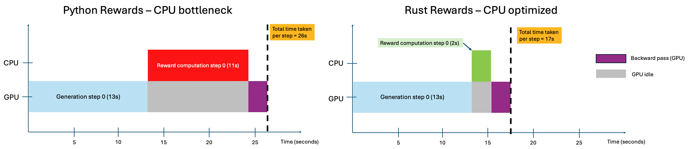
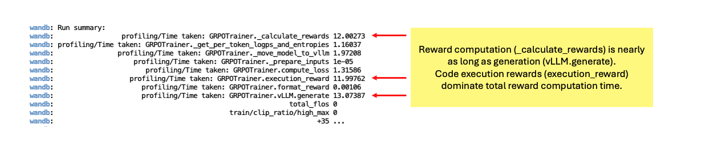
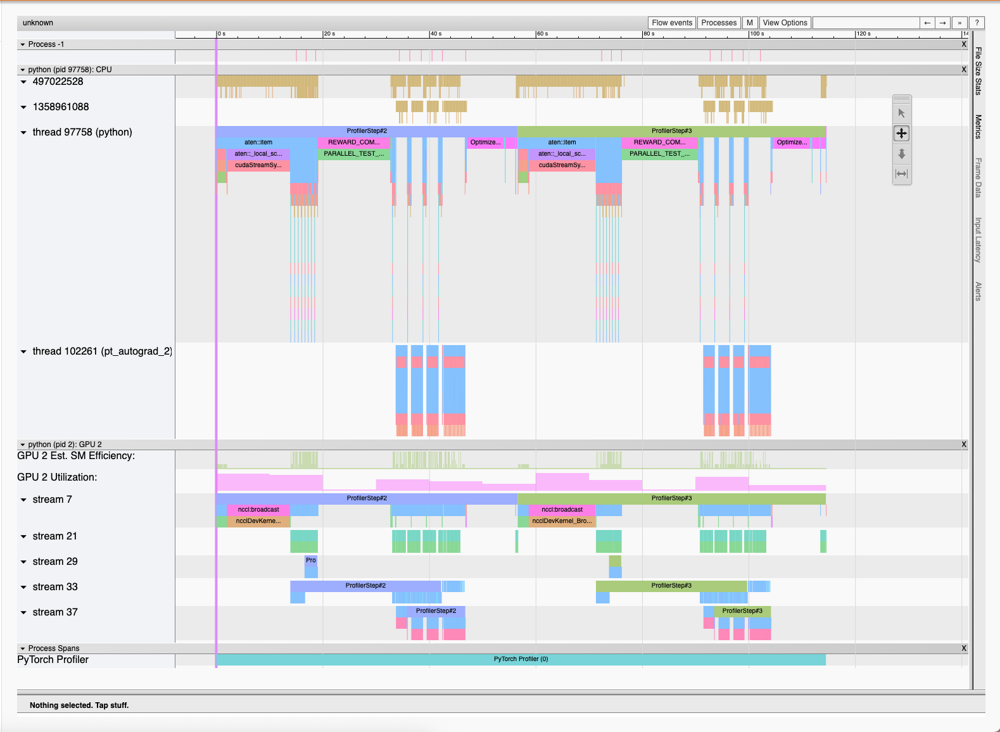
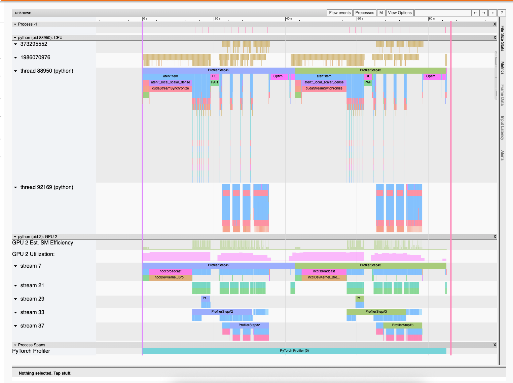
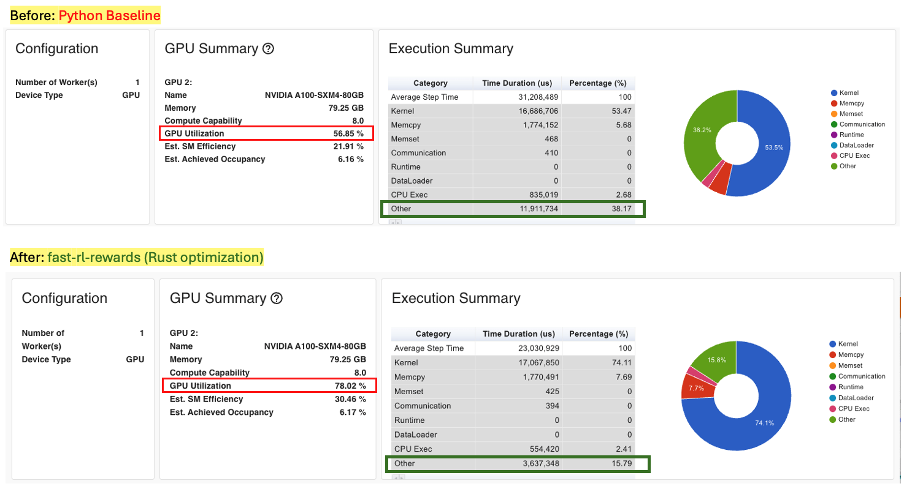

# 🦀 fast-rl-rewards

**High-performance Rust-based reward evaluator for RL training (PPO, GRPO, custom)**

## Overview
A scalable, high-performance reward evaluation framework for reinforcement learning. Built in Rust to offload CPU-heavy reward tasks - such as code execution, mathematical verification, tool-use scoring, and environment simulation - from Python RL workflows. This maximizes GPU utilization and enables faster, larger rollouts. 

<div align="center">
  <br>
  <figure>
  
    <figcaption><b>Figure 1:</b> Reward evaluation can take as long as generation in Python RL workflows, creating a CPU bottleneck and GPU idle time. <code>fast-rl-rewards</code> addresses this bottleneck with Rust-based parallelization, reducing reward latency and improving GPU utilization. </figcaption>
  </figure>
  <br><br>
</div>

**Key Features**: 
- 🧵 **Native Thread-level Parallelism** - Leverages [**Rayon**](https://crates.io/crates/rayon), achieving **near-linear throughput scaling** until full CPU core saturation.
- 🔒 **Sandboxed Execution** - Provides robust, timeout-protected sandboxing (via [**firejail**](https://github.com/netblue30/firejail)) for secure reward evaluation.
- 🐍 **Python API via PyO3** — [**PyO3 bindings**](https://crates.io/crates/pyo3) enable seamless integration with Python RL frameworks (e.g. HuggingFace TRL, VERL)
- 🧩 **Built-in Reward Functions** - Exposes a suite of built-in Rust reward functions optimized for CPU-intensive tasks. 
- 🧠 **User-Defined Rewards (UDFs)** *(coming soon)* - Allows users to define custom reward logic in Python, while `fast-rl-rewards` automatically parallelizes and executes it efficiently in Rust.
- 🌐 **Distributed Evaluation** *(planned)* — Integrates with Ray for distributed reward computation across multiple nodes or GPUs.

## Get Started
#### **1. Installation**

```bash
# Install Rust
curl --proto '=https' --tlsv1.2 -sSf https://sh.rustup.rs | sh
source $HOME/.cargo/env

# Create and activate a Python virtual environment
python -m venv rl-venv
source rl-venv/bin/activate

# Build and install fast-rl-rewards
cd fast-rl-rewards
maturin develop --release
```

#### **2. Example Usage (with HuggingFace TRL)**


```python
# Import Rust-backed reward functions
from fast_rl_rewards import format_reward, execution_reward

# Optional: use the RewardEvaluator class for advanced control
# from fast_rl_rewards import RewardEvaluator
# evaluator = RewardEvaluator(timeout_seconds=15, max_workers=32)
# reward_fns = [evaluator.format_reward, evaluator.execution_reward]

# Configure GRPO or PPO Trainer
training_args = GRPOConfig(
    # ... other parameters ...
    reward_functions=[
        format_reward,       # Rust-based format reward
        execution_reward     # Rust-based execution reward
    ],
)

trainer = GRPOTrainer(
    model=MODEL_NAME,
    args=training_args,
    train_dataset=dataset,
    # ... other setup ...
)

# Start training
trainer.train()

```
💡 See the examples/ directory for full integration examples.


## Performance and Scalability

### 1. Identifying Bottleneck
We profiled `fast-rl-rewards` on **Qwen2.5-Coder-7B-Instruct**, fine-tuned with the [**code-r1-12k dataset**](https://huggingface.co/datasets/ganler/code-r1-12k) - a 12K-sample RL dataset (2K LeetCode + 10K verified TACO samples) for code reasoning and execution tasks.

Experiments were run on **8xA100-SXM 80GB GPUs** using: 
- 6 GPUs for **prefill and policy optimization**
- 2 GPUs for **vLLM-based generation**
- `num_generations = 32`, `per_device_batch_size = 8`, `gradient_accumulation_steps = 4`

This configuration represents an ideal single-node inference setup. Generation throughput is optimized via vLLM parallelism, and CPU-bound reward computation is revealed as the next major bottleneck.
<div align="center">
  <br>
  <figure>
  
  <figcaption><b>Figure 2:</b> W&B profiling showing reward computation latency comparable to generation during Qwen2.5-Coder-7B training. </figcaption>
  </figure>
  <br><br>
</div>


### 2. Trace Visualization 

PyTorch Profiler traces show that the reward computation step in the Python baseline takes roughly 11s, nearly matching the generation step.
With `fast-rl-rewards`, this phase shrinks to around 2s, confirming significant CPU-side acceleration.

<div align="center">
  <br>
  <figure>
    
    <figcaption><b>Figure 3a:</b> Python baseline: Long CPU-bound reward spans (~11s) (REWARD_COM, PARALLEL_TEST), leading to GPU idle time.        </figcaption>
  </figure>
  <br><br>
</div>

<div align="center">
  <br>
  <figure>
    
    <figcaption><b>Figure 3b:</b> Rust optimization: Shorter reward spans (~2s) and improved overlap between CPU and GPU activity.</figcaption>
  </figure>
  <br><br>
</div>

### 3. GPU Utilization
<div align="center">
  <br>
  <figure>
  
  <figcaption><b>Figure 4:</b> Profiling comparison between Python (baseline) and Rust-optimized reward evaluation. </figcaption>
  </figure>
  <br><br>
</div>

- GPU utilization improved substantially (**56.8% → 78.0%**) while CPU “Other” time dropped (**38% → 16%**).

### 4. Scaling Results
To validate scaling efficiency, we benchmarked reward evaluation throughput across increasing rollout batch sizes. We fix the `num_generations = 16`. 

| Config     | per_device_batch_size | grad_accum_steps | total_batch_size | Python Reward (s) | Rust Reward (s) | Python Throughput<br>(completions/s) | Rust Throughput<br>(completions/s) |
| :--------- | :-------------------: | :--------------: | :--------------: | :---------------: | :-------------: | :----------------------------------: | :--------------------------------: |
| **Small**  |           8           |         4        |        512       |       11.21       |       2.26      |                  274                 |              **1,359**             |
| **Medium** |           8           |         8        |       1,024      |       13.22       |       4.17      |                  465                 |              **1,472**             |
| **Large**  |           16          |         8        |       2,048      |       17.31       |       9.35      |                  710                 |              **1,314**             |
| **XL**     |           16          |        16        |       4,096      |       27.19       |      18.26      |                  904                 |              **1,346**             |

- `fast-rl-rewards` accelerates reward computation by up to 5×,
sustaining near-linear throughput scaling (~1.4K completions/s) until full CPU saturation.
- Beyond this point, performance plateaus due to the fixed execution time of individual code-based rewards.
